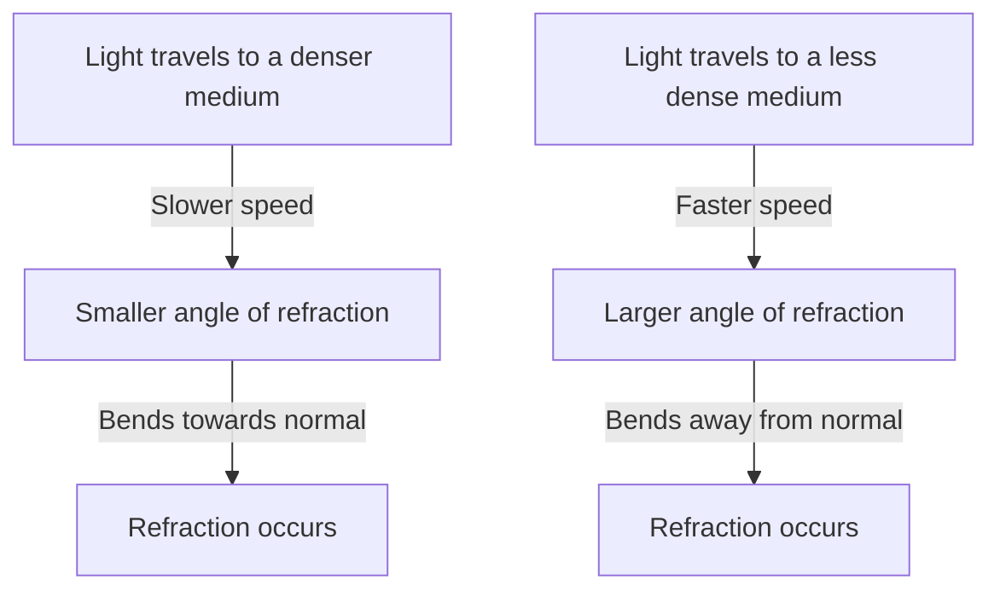

Specification reference: [[AQA Physics Specification#3.2.3 Refraction at a plane surface|3.2.3 Refraction at a plane surface]]

#### Refraction
Refraction is the change in direction of a wave  when it passes through a boundary between mediums of different densities.
- This change of direction is caused by a change in the speed of different parts of the wavefront as they hit the boundary.
- Medium - a transparent material
![[Pasted image 20241204114900.png | centre | 300]]

- The amount of refraction that takes place is determined by the **difference** between the angles of **incidence** ($i$) and **refraction** ($r$) of the waves at the boundary
- The angles of incidence and refraction are measured from the **normal line** (drawn at 90° to the boundary between the two media)
![[Pasted image 20241204115906.png | centre | 400]]
#### Refractive index
The **refractive index** of a material is the ratio of how fast light travels through that particular substance compared to the speed of light in a vacuum.
- It tells us how optically dense a material is.
- The refractive index of air is approximately $n=1$

> [!TLDR] Light speed
>The higher the refractive index of a material, then the more optically dense it is, and hence the slower light will travel through it

The refractive index of a material is calculated using the equation:
$$n = \frac{c}{c_{s}}$$where $n$ is the refractive index of the material, $c$ is the [[3.1.2 Longitudinal and transverse waves#Transverse and longitudinal waves|speed of light]] in a vacuum, and $c_{s}$ is the speed of light in a substance.

> [!INFO] Dimensionless
> Note that, being a ratio, the absolute refractive index is a **dimensionless** quantity. 
#### Snell's law
Snell's law relates to the angle of incidence to the angle of refraction at the boundary between two media, and is given by the equation:
$$
\begin{aligned}
n_{1} \sin \theta_{1} &= n_{2} \sin \theta_{2} \\[3mm]
\frac{n_{1}}{n_{2}} &= \frac{\sin \theta_{1}}{\sin \theta_{2}}
\end{aligned}

$$
Where:
- $n_{1}$ = the refractive index of material 1
- $n_{2}$ = the refractive index of material 2
- $\theta_{1}$ = the angle of incidence of the ray in material 1
- $\theta_{2}$ = the angle of refraction of the ray in material 2
![[Pasted image 20241205040907.png | centre | 500]]
##### Critical angle
The critical angle is the angle of incidence that provides an angle of refraction of 90 degrees. At the critical angle, the refracted ray is refracted along the boundary between the two materials.
![[Pasted image 20241205041007.png| centre | 500]]
- When the angle of incidence is less than the critical angle, then the ray is refracted and exits the material
- When the angle of incidence is greater than the critical angle, then the ray undergoes total internal reflection

The critical angle can be calculated using the following equation:
$$\sin \theta_{c} = \frac{n_{2}}{n_{1}} = \frac{\sin \theta_{1}}{\sin \theta_{2}}$$
##### Total internal reflection
Total internal reflection occurs when:
- the angle of incidence within the denser medium is greater than the critical angle ($i > \theta_{c}$)
- the incident refractive index $n_{1}$ is greater than the refractive index of the material at the boundary $n_{2}$ ($n_{1} > n_{2}$)

Total internal reflection follows the law of reflection:
$$\text{angle of incidence} = \text{angle of reflection} $$
Light rays inside a material with a higher refractive index are more likely to be totally internally reflected.