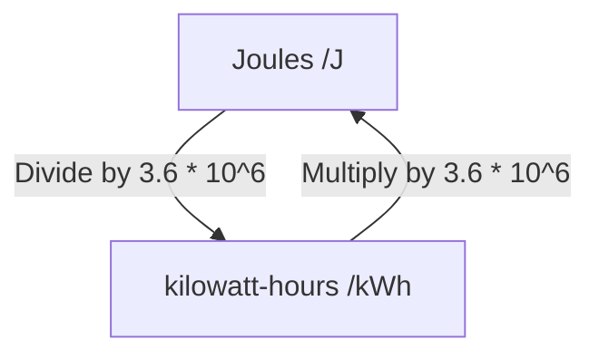

Specification reference: [[AQA Physics Specification#1.1 Use of SI units and their prefixes|1.1 Use of SI units and their prefixes]]
#### SI units
SI units are the fundamental or base units of physical quantities.

There are 7 base units:
1. Mass, measured in kilograms
2. Length, measured in metres
3. Time, measured in seconds
4. Amount of substance, measured in moles
5. Temperature, measured in kelvin
6. Electric current, measured in amperes
7. Light intensity, measured in candelas

##### Derived units
SI derived units are units of measurement derived from the seven SI base units.

| Quantity              | Derived unit | In base units                            |
| --------------------- | ------------ | ---------------------------------------- |
| Force                 | Newtons      | $kg \cdot m \cdot s^{-2}$                |
| Energy                | Joules       | $kg \cdot m^{2} \cdot s^{-2}$            |
| Pressure              | Pascals      | $kg \cdot m^{-1} \cdot s^{-2}$           |
| Power                 | Watts        | $kg \cdot m^2 \cdot s^{-3}$              |
| Electric charge       | Coulombs     | $s \cdot A$                              |
| Potential difference  | Volts        | $kg \cdot m^2 \cdot s^{-3} \cdot A^{-1}$ |
| Electrical resistance | Ohms         | $kg \cdot m^2 \cdot s^{-3} \cdot A^{-2}$ |
| Magnetic flux density | Teslas       | $kg \cdot s^{-2} \cdot A^{-1}$           |

#### SI unit prefixes

| Magnitude  | Prefix    |
| ---------- | --------- |
| $10^{12}$  | Tera (T)  |
| $10^9$     | Giga (G)  |
| $10^6$     | Mega (M)  |
| $10^3$     | Kilo (k)  |
| $10^{-2}$  | Centi (c) |
| $10^{-3}$  | Milli (m) |
| $10^{-6}$  | Micro (µ) |
| $10^{-9}$  | Nano (n)  |
| $10^{-12}$ | Pico (p)  |
| $10^{-15}$ | Femto (f) |
##### Electron volt (eV)#
The electron volt is the measure of an amount of kinetic energy gained by a single electron accelerating through an electric potential difference of one volt in vacuum. It has the value of $1.6 \times 10^{19}\text{ J}$.

##### Kilowatt hour (kWh)
The kilowatt hour is the amount of energy transferred by 1000W of power for an hour.

